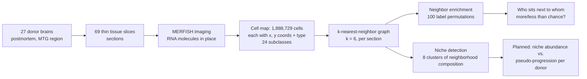
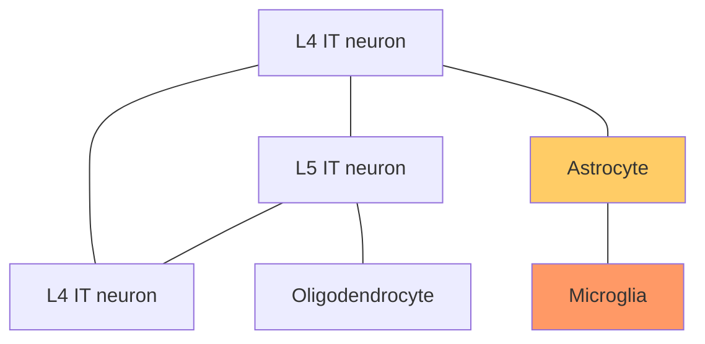
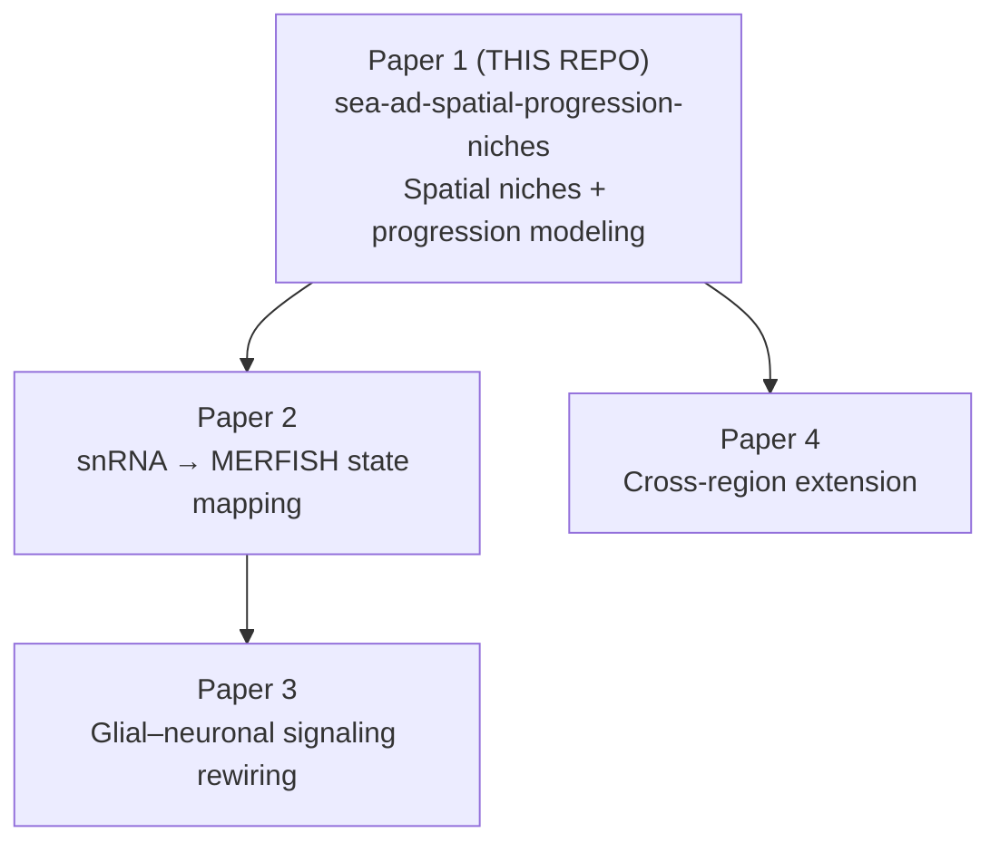

# Extended Introduction — A Zero-Background Guide to This Project

Welcome! This document assumes **no background** in neuroscience, biology, or academia. If you can read a map and follow a recipe, you can understand everything in this repository. We'll build up from "what is a brain cell?" to "why does this repo compute z-scores on neighbor graphs of 1.9 million brain cells?"

If you want the shorter, more technical version, see [docs/INTRODUCTION.md](INTRODUCTION.md). For exactly *how* the analysis works (and what is done vs. planned), see [docs/METHODS.md](METHODS.md).

## Part 1: Brains, cells, and why Alzheimer's is hard

### What is a brain cell?

Your brain is made of about 86 billion cells, and they come in two big families:

- **Neurons** — the "wiring." These are the cells that send electrical and chemical signals to each other, forming the circuits that produce thought, memory, and perception. They come in many subtypes. In the dataset this project analyzes, you'll see names like **L2/3 IT**, **L4 IT**, **L5 IT** (excitatory neurons living in different *layers* of the cortex — think of the cortex as a six-story building, and each floor houses different neuron types) and **Sst**, **Pvalb**, **Vip** (inhibitory neurons, the "brakes" of the system).
- **Glia** — the "support staff." For decades they were dismissed as glue, but they are essential:
  - **Astrocytes** manage energy supply and clean up chemical messengers at synapses.
  - **Microglia** are the brain's resident immune cells — part janitor, part security guard.
  - **Oligodendrocytes** wrap neurons' wiring in insulation (myelin) so signals travel fast.

Every one of these cell classes changes in Alzheimer's disease — that's a big part of why it's so hard to understand [2, 3].

### What is Alzheimer's disease, in plain terms?

Alzheimer's disease (AD) is the most common cause of dementia — the slow erosion of memory and thinking. Under a microscope, two abnormal protein deposits define it:

- **Amyloid plaques**: clumps of a protein fragment called amyloid-β that build up *between* cells, like litter accumulating in a park.
- **Tau tangles**: a protein called tau, which normally acts like railroad ties stabilizing tracks inside neurons, becomes chemically altered, twists into tangles, and the cell's internal transport system collapses.

These deposits don't appear overnight. They accumulate over decades in a remarkably predictable anatomical sequence, first mapped by Braak and Braak: tau starts near memory centers in the medial temporal lobe and gradually engulfs the rest of the cortex [1].

Here's the crucial twist: **pathology alone doesn't determine symptoms.** What matters for a person's cognition is how their *cells* respond to the pathology. Some microglia rally around plaques and contain them [4]; some astrocytes switch into inflammatory states [5]; some neuron types die early while others are resilient [9]. Understanding AD means understanding cellular responses — and those depend on *where* cells are and *who their neighbors are*.

## Part 2: From counting cells to mapping them

### The old way: blend the neighborhood

For the last decade, the workhorse technology has been single-cell / single-nucleus RNA sequencing (snRNA-seq). It reads the gene activity of individual cells — a molecular fingerprint that tells you each cell's type and state. Landmark studies used it to show that AD responses are strikingly cell-type-specific [2, 3], and large cohorts like ROSMAP scaled this to hundreds of donors and millions of cells [6, 7].

But there's a catch: to measure the cells, you have to **dissociate the tissue** — essentially put the brain sample in a blender. You learn exactly what each cell is, but you lose where it was.

**Analogy:** imagine studying a city by counting all the ingredients in all its restaurants. You'd learn a lot — lots of basil, so probably Italian places; lots of chili, probably Thai. But you'd have no idea whether the Italian restaurants cluster in one neighborhood, whether they sit next to the Thai places, or whether the neighborhood composition changes as you move across town.

### The new way: spatial transcriptomics

Spatial transcriptomics keeps the tissue intact and measures gene activity *in place*. Every cell keeps its address. The specific technology in this project, **MERFISH** (multiplexed error-robust fluorescence in situ hybridization), images hundreds of RNA species simultaneously, one molecule at a time, and reconstructs each cell's identity and (x, y) coordinates [8].

**Analogy, continued:** now you don't just know the city's ingredient totals — you know **every house's address and every kitchen's recipe**. You can ask: which cuisines are neighbors? Do certain combinations cluster together? Does that change from one side of town to the other? That's exactly what this repository computes, with brain cells instead of restaurants.

### What is SEA-AD?

The **Seattle Alzheimer's Disease Brain Cell Atlas (SEA-AD)**, led by the Allen Institute, is the largest public resource of this kind for human Alzheimer's [9]. It profiled the middle temporal gyrus (MTG — a cortical region affected relatively early in AD) of ~84 donors spanning the full spectrum from healthy to severe disease, with both snRNA-seq (~1.2 million nuclei) and MERFISH. Crucially, SEA-AD also assigns each donor a continuous **"pseudo-progression" score** — a number that orders donors along the disease continuum, from "no pathology" to "advanced disease." Think of it as a one-dimensional timeline reconstructed from cross-sectional data: we can't watch one brain over 30 years, but we can line up 84 brains from mildest to most severe and treat that ordering as a proxy for time.

All of the MERFISH data used here is **open access** — no special permissions or data-use agreements needed. It's downloaded from the AWS Open Data Registry by `scripts/download_seaad.py`.

### Why does location matter?

Because AD pathology is spatial. Plaques are focal objects — little disaster zones — and microglia cluster around them [4]. Vulnerable neuron types die in specific cortical layers [9]. If disease unfolds through local microenvironments, then the *spatial arrangement* of cells — which cell types sit next to which, and how those neighborhoods change across the progression continuum — is disease biology that dissociated data simply cannot see.

## Part 3: What this repository actually computes

### The data pipeline

The real-data run (see `reports/seaad_merfish_run_summary.json`) analyzed **1,888,729 cells** from **27 donors** and **69 sections**, using **24 cell-type subclasses**, **6 nearest neighbors**, **100 permutations**, and **8 niches**.

### Cells as a graph

The core trick is to turn the cell map into a **graph** — the math kind: nodes (dots) and edges (lines). Each cell is a node; we connect each cell to its 6 nearest neighbors in space. Then "who sits next to whom" becomes a countable thing: count the edges connecting each pair of cell types.

### The key formulas

We link to free learning resources instead of re-teaching basics. Each formula has one "what this number means" sentence.

**1. k-nearest-neighbor (k-NN) graph.** For each cell *i* with coordinates *xᵢ*, connect it to the *k* closest other cells by Euclidean distance, then symmetrize. We use **k = 6**.

$$A_{ij} = 1 \text{ if } j \in \text{6 nearest neighbors of } i \text{ (or vice versa), else } 0$$

*What this means:* each cell's "neighborhood" is its 6 physically closest cells — the people at its dinner table. Learn more: [StatQuest on KNN](https://www.youtube.com/watch?v=HVXime0nQeI).

**2. Neighborhood enrichment z-score.** For each ordered pair of cell types (a, b), count edges between them, then compare against what you'd get if cell-type labels were randomly shuffled across the fixed graph (100 shuffles):

$$z_{a,b} = \frac{N^{obs}_{a,b} - \mu^{null}_{a,b}}{\sigma^{null}_{a,b}}$$

*What this means:* **how many standard deviations above (or below) random chance** the observed neighbor count is. z = +3 means the pair sits together far more than chance; z = −3 means they avoid each other. Learn more: [StatQuest on p-values and permutation tests](https://www.youtube.com/watch?v=5Dnw46eC-0o), [Seeing Theory](https://seeing-theory.brown.edu/).

In our real run, the **most enriched pair was L4 IT – L5 IT (z = 31.2 ± 1.7)** — neighboring-layer excitatory neurons sit together, as cortical anatomy says they should (a good sanity check). The **most depleted pair was L2/3 IT – Oligodendrocyte (z = −55.3 ± 3.4)** — neurons of the upper layers and myelin-making glia almost never neighbor each other, consistent with oligodendrocytes concentrating in white matter.

**3. Spearman rank correlation (for progression, planned).** To test whether a niche's abundance tracks the disease continuum, correlate each donor's niche fraction with the donor's pseudo-progression score using ranks, not raw values:

$$r_s = \text{Pearson correlation of } \operatorname{rank}(\text{niche abundance}) \text{ vs. } \operatorname{rank}(\text{score})$$

*What this means:* **does the niche monotonically grow or shrink as disease advances**, without assuming the relationship is a straight line or that scores are normally distributed. Learn more: [StatQuest on correlation](https://www.youtube.com/watch?v=xZ_z8KWkhXE), [Khan Academy on correlation](https://www.khanacademy.org/math/statistics-probability/describing-relationships-quantitative-data).

### Where this sits in the series

This is **Paper 1 of 4** — the foundation. Everything later papers do builds on the dataset handling, niche definitions, and progression modeling established here.

## Part 4: The big questions and the honest limits

**Research questions:**

1. How do cell-type neighborhoods (spatial niches) in human MTG change along the AD pseudo-progression continuum?
2. Which niches are glia-dominated vs. neuron-dominated, and in what order do they remodel?
3. Can spatial graph features per donor predict neuropathological stage better than cell-type proportions alone?

**What we've already found (sanity checks on real data):** the enrichment landscape matches known anatomy (L4–L5 IT neurons strongly co-localize; upper-layer neurons and oligodendrocytes segregate), which says the pipeline measures real biology, not noise.

**The honest limits:** niche–progression associations will be *correlational* — we will be able to say "this neighborhood type shrinks as scores increase," not "this change causes decline." With 27 donors, donor-level statistics have limited power; that's why every statistical choice in this project is conservative (see [docs/METHODS.md](METHODS.md)).

## References

1. Braak H, Braak E. Neuropathological stageing of Alzheimer-related changes. *Acta Neuropathologica* 82, 239–259 (1991). doi:10.1007/BF00308809.
2. Mathys H, Davila-Velderrain J, Peng Z, et al. Single-cell transcriptomic analysis of Alzheimer's disease. *Nature* 570, 332–337 (2019). doi:10.1038/s41586-019-1195-2.
3. Grubman A, Chew G, Ouyang JF, et al. A single-cell atlas of entorhinal cortex from individuals with Alzheimer's disease reveals cell-type-specific gene expression regulation. *Nature Neuroscience* 22, 2087–2097 (2019). doi:10.1038/s41593-019-0539-4.
4. Keren-Shaul H, Spinrad A, Weiner A, et al. A unique microglia type associated with restricting development of Alzheimer's disease. *Cell* 169, 1276–1290.e17 (2017). doi:10.1016/j.cell.2017.05.018.
5. Habib N, McCabe C, Medina S, et al. Disease-associated astrocytes in Alzheimer's disease and aging. *Nature Neuroscience* 23, 701–706 (2020). doi:10.1038/s41593-020-0624-8.
6. Mathys H, Boix CA, Akay LA, et al. Single-cell multiregion dissection of Alzheimer's disease. *Nature* 632, 858–868 (2024). doi:10.1038/s41586-024-07606-7.
7. De Jager PL, Ma Y, McCabe C, et al. A multi-omic atlas of the human frontal cortex for aging and Alzheimer's disease research. *Scientific Data* 5, 180142 (2018). doi:10.1038/sdata.2018.142.
8. Chen KH, Boettiger AN, Moffitt JR, Wang S, Zhuang X. Spatially resolved, highly multiplexed RNA profiling in single cells. *Science* 348, aaa6090 (2015). doi:10.1126/science.aaa6090.
9. Gabitto MI, Travaglini KJ, Rachleff VM, et al. Integrated multimodal cell atlas of Alzheimer's disease. *Nature Neuroscience* 27, 2366–2383 (2024). doi:10.1038/s41593-024-01774-5.
10. Zhao E, Stone MR, Ren X, et al. Spatial transcriptomics at subspot resolution with BayesSpace. *Nature Biotechnology* 39, 1375–1384 (2021). doi:10.1038/s41587-021-00935-2.
11. Palla G, Spitzer H, Klein M, et al. Squidpy: a scalable framework for spatial omics analysis. *Nature Methods* 19, 171–178 (2022). doi:10.1038/s41592-021-01358-2.

**Free learning resources:** [StatQuest](https://statquest.org/) (statistics and ML, video), [3Blue1Brown](https://www.3blue1brown.com/) (visual math intuition), [Khan Academy statistics](https://www.khanacademy.org/math/statistics-probability), [Seeing Theory](https://seeing-theory.brown.edu/) (interactive probability).
