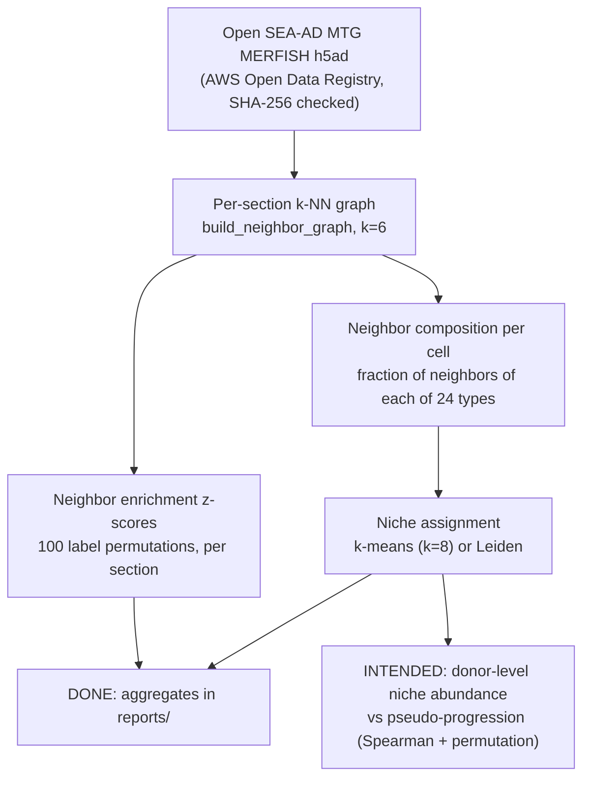
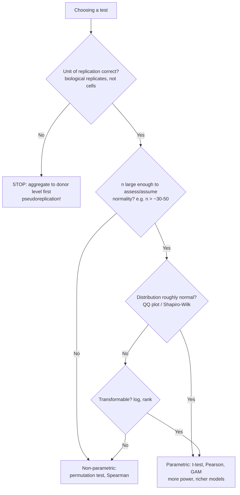

# Extended Methods & Materials

This document is written for new contributors who are **new to data science**. It explains what the pipeline does, *why* each design decision was made, and — most importantly — **what is actually done versus what is only planned**. For background reading, start with [docs/EXTENDED_INTRODUCTION.md](EXTENDED_INTRODUCTION.md).

## Analysis overview

## Done

These components exist, run end-to-end on the real data, and are covered by tests:

| Component | Where | Status |
|---|---|---|
| Download + integrity-check open MERFISH data (~500 MB h5ad) | `src/seaad_niches/download.py`, `scripts/download_seaad.py` | Done — size + SHA-256 verified, cached |
| Per-section k-NN neighbor graphs (k = 6) | `src/seaad_niches/spatial.py` | Done — 69 sections |
| Neighbor-enrichment z-scores (100 permutations, label-shuffle null) | `src/seaad_niches/spatial.py` | Done — aggregates in `reports/` |
| Niche detection (8 niches per section; Leiden if installed, k-means fallback) | `src/seaad_niches/niches.py` | Done |
| Synthetic validation: planted enrichment, planted niche recovery, planted gradient, io gating, mocked-network download tests | `src/seaad_niches/simulate.py`, `tests/` | Done — `make test` |

**Real-data results so far** (`reports/seaad_merfish_run_summary.json`): 1,888,729 cells, 27 donors, 69 sections, 24 cell-type subclasses, k = 6, 100 permutations, 8 niches, seed 0. Top enriched neighbor pair: **L4 IT – L5 IT, mean z = 31.2** (SEM 1.7). Top depleted: **L2/3 IT – Oligodendrocyte, mean z = −55.3** (SEM 3.4). Both match known cortical anatomy — a strong pipeline sanity check.

## Intended

These are **planned, not yet implemented or not yet run**. Do not cite them as results:

| Planned work | Tracking issue |
|---|---|
| Donor-level niche abundance vs. pseudo-progression modeling (Spearman + score-permutation test; `progression.py` exists but awaits donor-level scores) | issue #1 |
| QC'd, frozen, versioned analytical dataset (harmonized labels, covariates) | issue #2 |
| Sensitivity and null analyses (k sweep, niche-count sweep, label-shuffle negative controls) | issue #4 |
| Manuscript writing and figure production | issue #6 |

## Design decisions and WHY

### Why k-NN graphs instead of radius graphs?

`build_neighbor_graph` supports both, but the pipeline uses **k-NN**. A radius graph ("connect everything within distance r") breaks when cell density varies — and it does vary, both within a section (layers vs. white matter) and between donors. In dense regions a fixed radius gives a cell hundreds of neighbors; in sparse regions, zero. k-NN gives **every cell exactly k neighbors**, so neighborhood composition vectors are comparable across the whole dataset. The cost: k-NN ignores absolute distance, so in very sparse regions "neighbors" may be far away. For comparing *composition* across sections, comparability wins.

### Why k = 6?

A cell in 2D tissue has roughly 6 immediate physical contacts (think hexagonal packing). Smaller k makes composition vectors noisy (each neighbor is 1/k of the vector); larger k dilutes the local signal by averaging over distant cells. k = 6 is the standard default in spatial-omics tooling (e.g., Squidpy [11]) and matched to tissue geometry. A k-sweep sensitivity analysis is planned (issue #4) to confirm results don't hinge on this choice.

### Why 100 permutations?

The enrichment statistic compares observed neighbor-pair counts to a **label-shuffle null**: keep the graph fixed, randomly reassign cell-type labels, recount. 100 permutations gives a stable estimate of the null mean and standard deviation for z-scoring at acceptable compute cost (the null is recomputed for all 24×24 type pairs × 69 sections). Note the resolution limit: with 100 permutations you can estimate *z-scores* well but not tiny permutation *p-values* (the finest possible is ~0.01). That is fine here because the enrichment analysis reports z-scores, not p-values. The progression module uses 1,000 permutations where p-value resolution matters more.

### Why permutation nulls at all?

A parametric null ("assume edges are Poisson/binomial with rate X") requires assumptions about edge-count distributions that are demonstrably violated in spatial tissue: cells can't overlap, tissue has edges and holes, and cell types differ wildly in abundance. Permutation makes **no distributional assumption** — it answers exactly the question we care about: "how surprising is this neighbor count, given this exact graph geometry and these exact cell-type frequencies?" The price is compute and the resolution limit above.

### Why the k-means fallback instead of requiring Leiden?

Leiden community detection is the field standard for clustering cells, but it depends on the optional `leidenalg` + `igraph` packages, which can be painful to install (compiled dependencies). This repo's golden rule is that **the core pipeline must run with only numpy/pandas/scipy/scikit-learn**, so `assign_niches` falls back to deterministic k-means (`n_init=10`, fixed seed) when Leiden isn't importable. Trade-off: k-means needs a fixed cluster count (we use 8) and assumes roughly spherical clusters; Leiden finds its own partition size. For per-section niche maps used as compositional summaries, k-means is adequate; `method="leiden"` is available for the manuscript phase.

### Why donor-level statistics for progression (pseudoreplication!)

This is the single most important statistical decision in the project. We have ~1.9 million cells but only **27 donors**. Cells from the same donor are **not independent** — they share genetics, lifestyle, agonal state, tissue processing. If we correlated per-cell values against progression, we'd get millions of "data points" and absurdly tiny p-values that mean nothing. That's **pseudoreplication**: treating technical replicates as biological replicates. The correct unit of replication for a disease-progression question is the **donor**. So `niche_progression_association` first collapses cells into per-donor niche abundances (fractions), then correlates 27 donor-level numbers with 27 donor-level scores. n = 27, honestly reported in the output's `n_donors` column.

## Statistics for newcomers

### Permutation tests

Idea: if there were truly no association, shuffling the labels (or scores) should give statistics just as extreme as the observed one. The p-value is the fraction of shuffles at least as extreme as reality — we use the conservative `(1 + #extreme) / (1 + n_permutations)` form, which can never return 0. Free explainer: [StatQuest — permutation tests](https://www.youtube.com/watch?v=5Dnw46eC-0o).

### Z-scores

How many standard deviations an observation sits from the null mean. |z| > 2 is a common "noteworthy" threshold; our top pair (z = 31.2) is ~15× beyond that. Z-scores are **effect-size-like**: they tell you how big the surprise is, not just whether it exists.

### Multiple testing / FDR

The enrichment matrix tests 24 × 24 = 576 type pairs per section. Test that many hypotheses and some will look significant by pure luck. The planned progression analysis (8 niches, and more in sensitivity runs) will use **Benjamini–Hochberg FDR correction** (already noted in `progression.py`'s docstring as the caller's responsibility). BH controls the expected fraction of false discoveries among your hits, rather than demanding every hit be bulletproof (Bonferroni) — the right trade when you expect multiple true effects. Free explainer: [StatQuest — FDR](https://www.youtube.com/watch?v=K8LQSvtjcEo).

### Parametric vs. non-parametric: the decision guide

**Parametric tests** (t-test, Pearson correlation, ANOVA, linear regression) assume your data (or residuals) follow a specific distribution — usually normal. When the assumptions hold, they're the most powerful option and their models are interpretable. When assumptions fail, their p-values are wrong.

**Non-parametric / resampling methods** (permutation tests, Spearman, Mann–Whitney, bootstrap) assume much less — typically only that observations are independent and exchangeable under the null. Cost: somewhat less power when parametric assumptions actually hold, and less tidy effect estimates.

**Where this project lands:**

| Question | n | Decision | Status |
|---|---|---|---|
| Neighbor enrichment | millions of edges, fixed graph | Permutation null → z-scores (no distribution assumption) | Done |
| Niche vs. progression | 27 donors | Spearman + score permutation: small n, unknown distribution | Intended (issue #1) |
| Covariate-adjusted modeling (age, sex, PMI) | 27 donors | **Not yet decided.** Option A: GAM with donor-level permutation (richer, parametric-ish, risky at n=27). Option B: stratified/partial Spearman via permutation (robust, less flexible). Rule: if residuals pass normality checks and n stays ~27, prefer B for the main claim and A as sensitivity; if the cohort grows substantially, revisit. | Open |

### Correlation choices, same logic

- **Pearson** measures *linear* association; assumes (roughly) bivariate normality; sensitive to outliers.
- **Spearman** correlates *ranks*; captures any monotonic relationship; robust to outliers and skew. With 27 donors and no guarantee that pseudo-progression scores are uniformly or normally distributed, Spearman is the defensible default — one outlier donor can otherwise dominate a Pearson coefficient.

## Data-science hygiene concepts

**Train/test hygiene.** This project currently does descriptive analysis, not prediction, so there is no train/test split yet. When Paper 1's question 3 ("can spatial features predict stage?") is tackled, donors — never individual cells — must be the split unit, for the same pseudoreplication reason. Any preprocessing that uses labels (e.g., feature selection) must happen inside the cross-validation loop.

**Seeds and reproducibility.** Every stochastic step takes an explicit `seed` (the real run used seed 0): permutation shuffles, k-means (`random_state`), Leiden. The download is integrity-checked with SHA-256 and recorded in `MANIFEST.json`. If you add randomness, add a seed parameter — no exceptions.

**Batch effects.** Sections differ in tissue quality, imaging conditions, and donor. That's why all spatial statistics here are computed **per section** and only then aggregated (mean ± SEM across sections) — never pool cells across sections before computing enrichment, or section identity confounds everything. Donor-level covariates (age, sex, postmortem interval) are a planned adjustment in the progression model (issue #1).

**Multiple comparisons.** Covered above — assume that any screen of hundreds of statistics needs FDR control unless proven otherwise.

**Effect size vs. p-value.** With 1.9M cells, *everything* is "significant" if you let cell counts drive the statistics. This is another reason the pipeline leads with z-scores (magnitude of surprise) and collapses to donor level before testing. When reading any result, ask: how big is the effect (z, Spearman r, fold change), not just how small is the p-value. A p = 0.001 with r = 0.05 on 27 donors is noise dressed up; an r = 0.7 with a modest p-value is a lead worth chasing.

## References

9. Gabitto MI, et al. Integrated multimodal cell atlas of Alzheimer's disease. *Nature Neuroscience* 27, 2366–2383 (2024). doi:10.1038/s41593-024-01774-5.
10. Zhao E, et al. Spatial transcriptomics at subspot resolution with BayesSpace. *Nature Biotechnology* 39, 1375–1384 (2021). doi:10.1038/s41587-021-00935-2.
11. Palla G, et al. Squidpy: a scalable framework for spatial omics analysis. *Nature Methods* 19, 171–178 (2022). doi:10.1038/s41592-021-01358-2.

**Free learning resources:** [StatQuest](https://statquest.org/) (permutation tests, FDR, p-values), [Seeing Theory](https://seeing-theory.brown.edu/), [3Blue1Brown](https://www.3blue1brown.com/), [Khan Academy statistics](https://www.khanacademy.org/math/statistics-probability).
