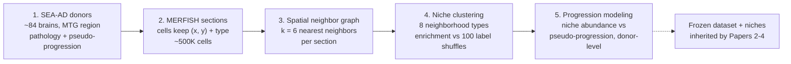

# Concept Figure — Spatial Niche Remodeling Pipeline (Paper 1)

> **Note.** The primary concept figure for this repository is [`concept_figure.svg`](concept_figure.svg) in this folder — a flat, pastel, NeurIPS-style architecture diagram that renders directly on GitHub. A raster PNG version (1536x1024, opaque white background, same design) was also generated with an image-generation model, but the repository tooling available for this commit accepts text content only, so the binary PNG could not be uploaded. This file additionally records the diagram as Mermaid source so it can be edited and re-rendered.

**Caption:** From donor brains to progression biology: SEA-AD donors are imaged with MERFISH so every cell keeps its (x, y) coordinates and type; cells are linked into a 6-nearest-neighbor graph; neighborhoods are clustered into ~8 niches and scored for neighbor enrichment against 100 label shuffles; niche abundance is then modeled against each donor's pseudo-progression score.

