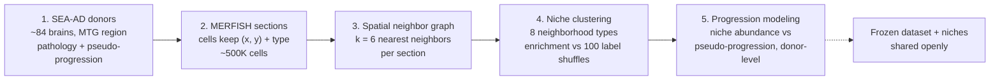

# Concept Figure — Spatial Niche Remodeling Pipeline 

> **Note.** The rendered concept figure is [`01-concept-schematic.png`](01-concept-schematic.png) in this folder — a generated scientific illustration. This file keeps the Mermaid source of the same diagram so it remains editable and re-renderable.

**Caption:** From donor brains to progression biology: SEA-AD donors are imaged with MERFISH so every cell keeps its (x, y) coordinates and type; cells are linked into a 6-nearest-neighbor graph; neighborhoods are clustered into ~8 niches and scored for neighbor enrichment against 100 label shuffles; niche abundance is then modeled against each donor's pseudo-progression score.

